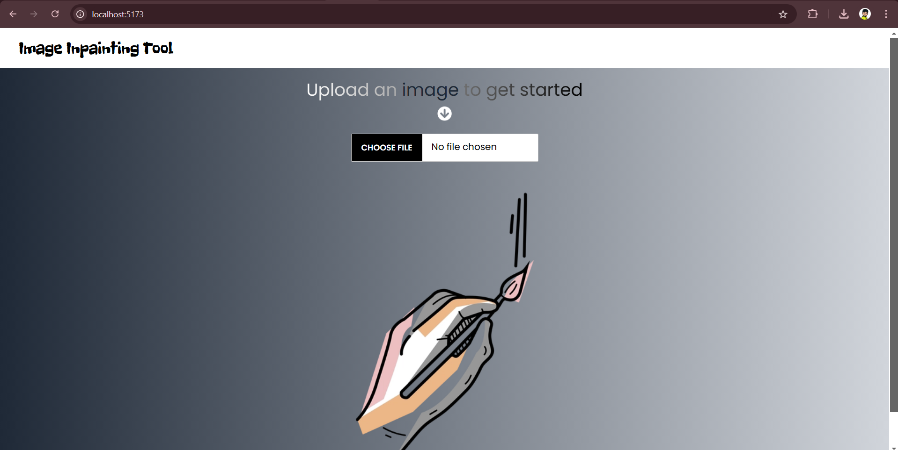
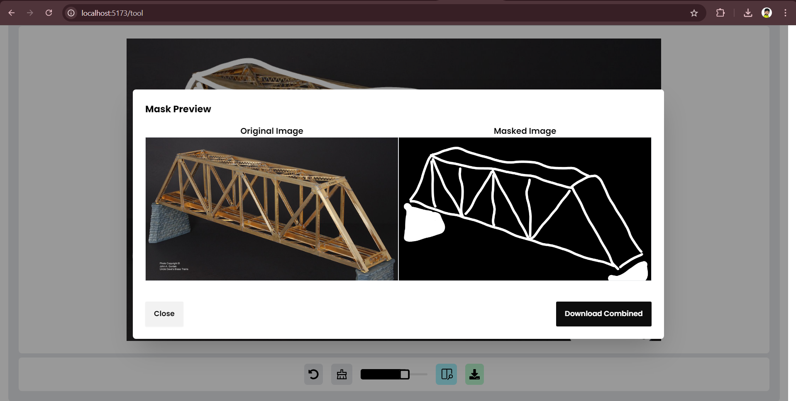

# Image Inpainting Tool

This project is an image inpainting web application built with a full-stack architecture, utilizing FastAPI for the backend, React for the frontend, and SQLite for storing metadata of images and associated masks. It allows users to upload images, apply masks, and manage these files. The system is designed to handle image and mask uploads, store their metadata, and provide endpoints for image retrieval and updates.

## Table of Contents

1. [Technologies](#technologies)
2. [Features](#features)
3. [Getting Started](#getting-started)
    - [Prerequisites](#prerequisites)
    - [Installation](#installation)
    - [Usage](#usage)
4. [Implementation Details](#implementation-details)

## Technologies
- **Frontend**: React, Typescript, TailwindCSS, Daisy UI, React Hot toast
- **Canvas**: React-Canvas-Draw
- **Backend**: FastAPI
- **Database**: SQLite
- **Containerisation**: Docker, Docker Compose


## Features
- **Image Upload**: Users can upload images in JPEG or PNG formats.

- **Masking**: Uploaded Image can be masked with a brush resulting in the background image being in black and drawn area in white.
- **Tools**: Undo, Erase, Brush size, Download and Preview Image.
- **Image Metadata:**:  All uploaded images and masks are stored in a database, making it easy to manage and retrieve them.
- **Comparison of Image**: Original image and Masked Image being displayed side by side for comparison.

- **Image Export**: Download masked image separately, as well as combined form of image with original and masked image as a pair.


## Getting Started
Follow these instructions to set up and run the project on your local machine.

### Prerequisites
- Node.js
- npm (or Yarn)
- Python (for backend)
- Virtual environment (recommended for backend dependencies)
- Docker
- Docker Compose

### Installation

1. **Clone the Repository**:
   ```bash
   git clone git@github.com:Vaibhav-shrivastav/Image_Inpainting_Tool.git
   cd Image_Inpainting_Tool
   ```


2. Run Docker-Compose

    ```bash
    docker-compose up --build
    ```

### Usage

1. Visit the frontend URL (http://localhost:5173) in your browser.
2. Upload a image file(jpeg/png) using the Choose file option.
3. Once the image is uploaded, you will be redirected to the playground.
4. Adjust Brush size accordingly, and start painting your image!

## Implementation Details

### Frontend (React.js)

- **Tailwind CSS and Daisy UI:** For styling as UI libraries.
- **React Hot Toast:** Provides user feedback with notifications for actions like successful image upload, errors, etc.
- **Axios :**  Handles HTTP requests between the frontend and backend server.

### Backend

- **FastAPI:** Python-based web framework to create APIs.
- **SQLite:** Lightweight database used for storing uploaded image metadata.
- **API Routes:**
    - `/upload_image/`: Accepts a image(JPEG/PNG format) file and returns a document metadata.
    - `/images`: Gets current image to be used in the playground.